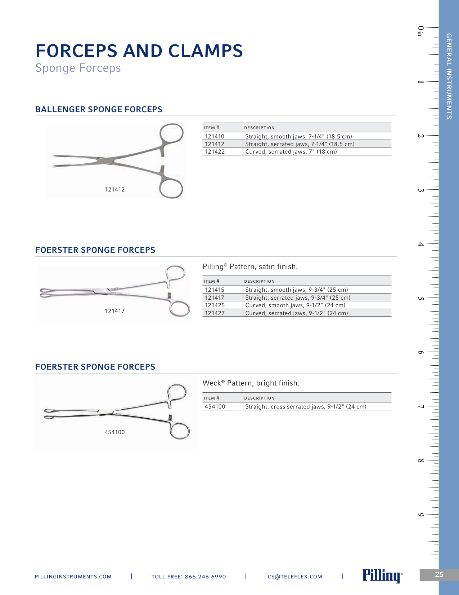
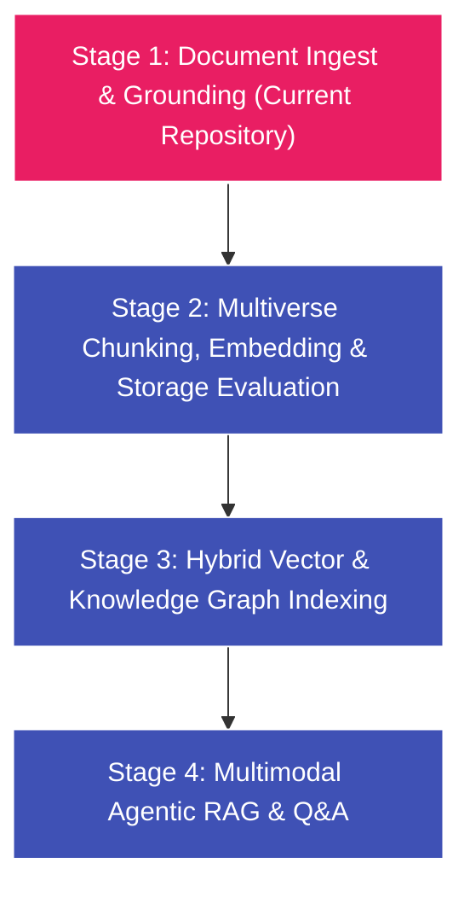
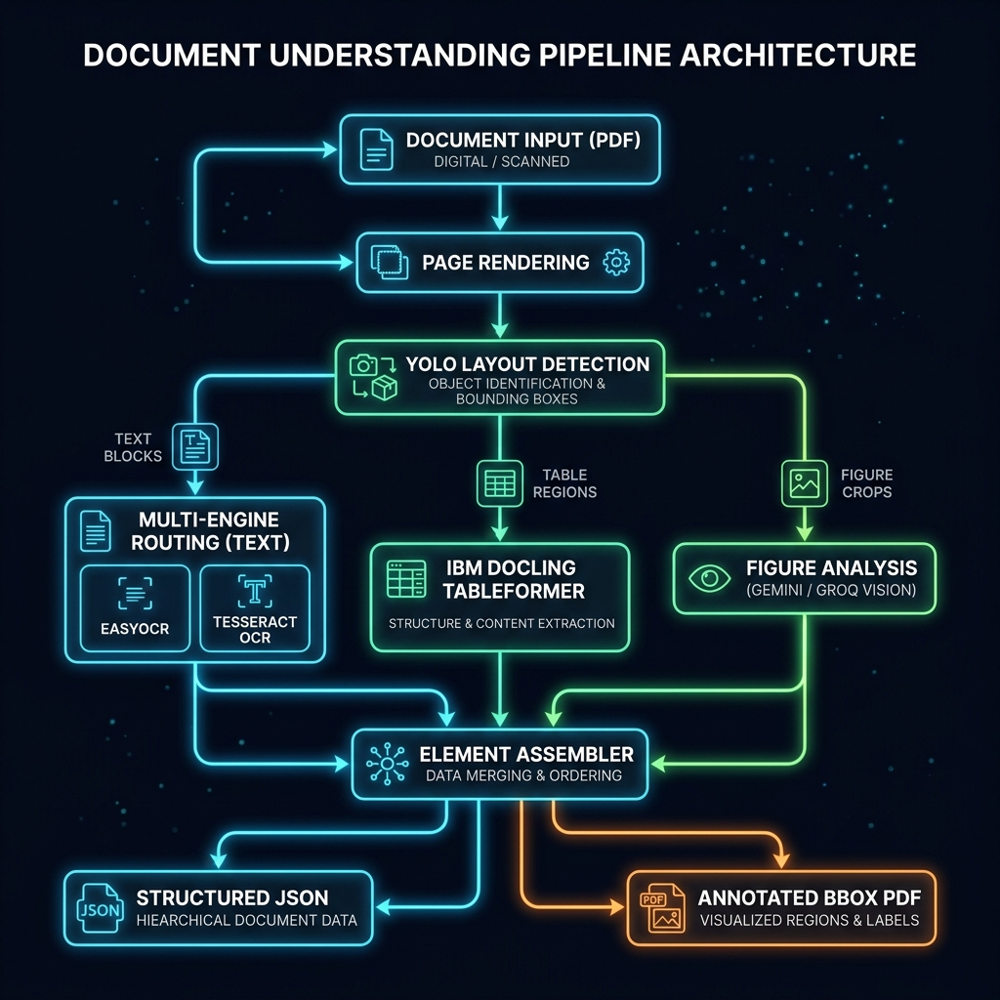
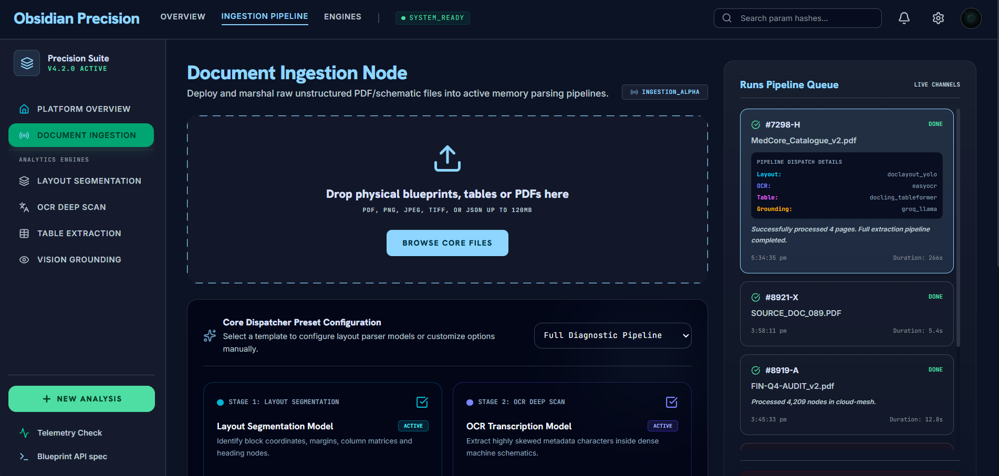
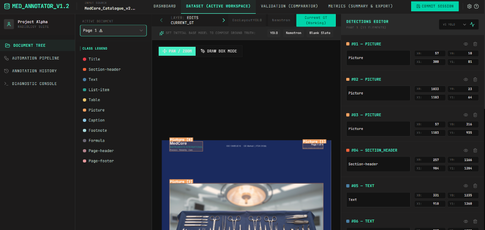

# Unified Document Understanding & Layout Benchmarking Platform

A consolidated, production-ready enterprise suite for layout segmentation, OCR routing, high-fidelity table structure reconstruction, coordinate-based visual grounding, and manual ground-truth annotation. 

This repository houses three previously separate research modules in a unified, clean, and symmetric workspace:
1. **Document Ingest Pipeline & GUI** (`obsidian-precision/`)
2. **Visual Annotator Tool** (`layout_annotator/`)
3. **Consolidated Benchmarking Workspace** (`benchmarking/`)

---

## Problem Statement & Core Challenges

Traditional document ingestion pipelines suffer from the **Linear Scan Bottleneck**. By reading PDFs as a 1D stream of characters, they jumble double-column text, distort borderless tables, discard reading orders, and completely drop visual diagrams. 

A real-world document page (such as a medical catalogue, scientific journal, or invoice) is a complex, heterogeneous 2D canvas containing multiple entities simultaneously:



To build a hallucination-free **Multimodal Document Q&A / RAG system**, we cannot rely on linear text. The pipeline must:
- Segment the page as a **2D spatial grid** using coordinate bounding boxes (`x0, y0, x1, y1`).
- Reconstruct borderless tables into high-fidelity cell-spanning markdown grids.
- Run coordinate-based geometry matching to ground visual figure crops with their parallel adjacent specs tables and nearby descriptions.
- Dynamic route native digital text layers and scanned image layers to distinct OCR pipelines.

---

## Multimodal Q&A Pipeline Roadmap

This repository represents **Stage 1 (Layout-Aware Ingestion & Grounding Foundation)** of our end-to-end Multimodal Document Q&A Roadmap:



1. **Stage 1: Document Ingest & Grounding (Active)**: Ingests PDFs, extracts bounding boxes, routes scanned regions to OCR, recovers tables, runs 2D visual grounding, and packages structured JSON.
2. **Stage 2: Multiverse Chunking, Embedding & Storage Evaluation (Future)**: An advanced multi-modal orchestration pipeline comparing various chunking strategies (Layout-Aware, Semantic, Fixed-Token) and embedding models (dense vs. sparse, late-interaction) across multiple Vector Database targets. This stage incorporates rigorous Ground Truth evaluation using RAGAS and DeepEval frameworks to evaluate retrieval accuracy, faithfulness, and context recall.
3. **Stage 3: Hybrid Graph Indexing (Future)**: Stores text blocks in vector databases while mapping layout relations (e.g. `IMAGE -[ABOVE]-> TABLE`) in Graph databases (Neo4j).
4. **Stage 4: Multimodal Agentic RAG (Future)**: Spawns an agent equipped with graph traversal and vector search tools to locate exact visual crops and generate pixel-perfect, citation-backed answers.

---

## Ingest Pipeline Workflow & Architecture

The ingestion pipeline executes sequentially across six distinct, modular stages:



1. **PDF Rendering**: Converts PDF pages into high-resolution PNG frames at 150 DPI.
2. **Layout Detection**: Scans each frame to segment the canvas into specific coordinate zones (headings, paragraphs, tables, figures, footers) using `DocLayout-YOLOv10` or `NVIDIA Nemotron-Parse`.
3. **Table Grid Reconstruction**: Recovers table bounding boxes and parses complex grids (nested headers, borderless cells) into markdown table syntax via `IBM Docling TableFormer` or `TATR`.
4. **Context-Grounded VLM Captioning**: Crops figure regions and passes them to VLMs (Groq Llama-4-Scout, Local Ollama) alongside adjacent coordinate-grounded text to generate detailed, grounded captions.
5. **OCR & Digital Text Routing**: Dynamically parses native digital text zones using `PyMuPDF`/`pdfplumber`, while routing scanned/handwritten image zones to CRAFT+CRNN-based `EasyOCR` or `Tesseract`.
6. **Unified Packaging**: Compiles segmented block coordinates, OCR text, markdown tables, and captioned figures into a structured `result.json` and color-coded BBox PDF.

---

## Repository Structure

```text
Document_Understanding/
├── algorithms/              # Core Document_Understanding algorithms
│   ├── layout_detection/    #   Layout segmenters (YOLOv10, Nemotron-Parse, LandingAI)
│   ├── text_extraction/     #   Text extraction & OCR (PyMuPDF, EasyOCR, Tesseract)
│   ├── table_extraction/    #   Table structure recovery (IBM Docling TableFormer, TATR)
│   └── image_extraction/    #   VLM Crop Captioning (Groq Llama-4-Scout, Local Ollama)
│
├── benchmarking/            # Consolidated Benchmarking & Results (from D:\)
│   ├── src/                 #   Benchmarking React SPA app
│   ├── results/             #   Model benchmarks, domain breakdowns & heatmaps
│   │   └── legacy_layout_benchmarks/  # Merged layout scores from C:\
│   └── backend/             #   Evaluation python orchestrators & scripts
│
├── obsidian-precision/      # Main Document Understanding Web Application
│   ├── frontend/            #   React + Vite web interface dashboard
│   └── backend/             #   FastAPI backend server & SQLite job database
│
├── layout_annotator/        # Manual BBox Ground Truth Creation Web Application
│   ├── frontend/            #   HTML5 Canvas bounding box editor interface
│   └── backend/             #   Inference backend and session save controllers
│
├── data/                    # PDF Document datasets (Scientific, Legal, Financial, etc.)
├── notebooks/               # Analysis and visualization notebooks
├── others/                  # Auxiliary configuration, Docker, and environment setups
│   ├── Dockerfile
│   ├── docker-compose.yml
│   ├── config.yaml
│   ├── requirements.txt
│   └── uv.lock
├── README.md                # Master project overview (this file)
└── main.py                  # CLI orchestrator entrypoint
```

---

## Web Applications Overview

### 1. Obsidian Precision (Ingest GUI Dashboard)
A professional, dark-themed dashboard to visualize pipeline outputs interactively.
- **Features**: Interactive bounding box canvas layer with hover confidence metrics, collapsible JSON explorer, progressive SSE real-time stream, and reconstructed HTML table views with CSV exports.



### 2. Layout Annotator (Manual BBox GT Creator)
A specialized tool to annotate, correct, and evaluate bounding box coordinates.
- **Features**: HTML5 Canvas click-and-drag coordinate annotator, multi-layer workspace tabs (`GT` ground truth vs `DocLayoutYOLO` vs `Nemotron` vs `LandingAI`), comparative overlap metrics, and session database backups.



---

## Model Evaluation Leaderboards

All models evaluated in this suite are open-source (or open-weights), allowing for local hosting, customization, and cost-effective deployment. They have been benchmarked across standard datasets (PubLayNet, DocLayNet, MedCore_Catalogue) for layout detection, text OCR, table extraction, and VLM figure analysis:

### 1. Layout Detection Benchmark Scorecard
*Evaluated across all 5 domains (Commercial, Financial, Legal, Medical, Scientific) for geometric bounding box prediction:*

| Model | Usability Rank | Reference Link | mAP@50 | mAP@50:95 | Precision | Recall | F1-Score | mean IoU | Avg Latency (s/page) |
| :--- | :---: | :---: | :---: | :---: | :---: | :---: | :---: | :---: | :---: |
| **DocLayout-YOLO** | 1 | [GitHub](https://github.com/opendatalab/DocLayout-YOLO) | 0.0556 | 0.0376 | 0.1358 | 0.0638 | 0.0868 | **0.8299** | **17.27s** |
| **NVIDIA Nemotron-Parse** | 2 | [Hugging Face](https://huggingface.co/nvidia/NVIDIA-Nemotron-Parse-v1.2) | **0.1110** | **0.0436** | 0.1245 | 0.0638 | 0.0844 | 0.6470 | 71.00s |

### 2. Table Extraction & Reconstruction Scorecard
*Evaluated on complex tables containing multi-row cells and borderless grids:*

| Model | Usability Rank | Reference Link | TEDS (Overall) | TEDS (Structure) | GriTS (Top) | Cell F1 |
| :--- | :---: | :---: | :---: | :---: | :---: | :---: |
| **Docling TableFormer** | 1 | [GitHub](https://github.com/docling-project/docling) | 0.7295 | 0.7295 | 0.9828 | **0.9828** |
| **Table Transformer (TATR)** | 2 | [GitHub](https://github.com/microsoft/table-transformer) | **0.7444** | **0.8684** | **1.0000** | 0.4213 |

### 3. Text OCR (Scanned Document Engine) Scorecard
*Evaluated on non-digital image inputs to capture character error rates (CER) and word error rates (WER):*

| Model | Usability Rank | Reference Link | Corpus CER | Corpus WER | Macro CER | Macro WER | Exact Match Rate |
| :--- | :---: | :---: | :---: | :---: | :---: | :---: | :---: |
| **EasyOCR** | 1 | [GitHub](https://github.com/JaidedAI/EasyOCR) | **10.78%** | 23.08% | **8.06%** | 19.73% | 31.25% |
| **Tesseract OCR** | 2 | [GitHub](https://github.com/tesseract-ocr/tesseract) | 13.28% | **18.32%** | 11.11% | **17.13%** | **68.75%** |

### 4. Vision Language Model (Figure Analysis & Captioning) Scorecard
*Evaluated on medical instrument catalogs and figures to rate description quality and attribute accuracy:*

| Model | Usability Rank | Reference Link | Type | BLEU-4 | ROUGE-L | BERTScore | Attr F1 | Avg Latency (s) | Peak VRAM |
| :--- | :---: | :---: | :--- | :---: | :---: | :---: | :---: | :---: | :---: |
| **meta-llama/llama-4-scout-17b** | 1 | [Hugging Face](https://huggingface.co/meta-llama/Llama-Scout-17B-Instruct) | Groq API | 0.0252 | **0.2757** | **0.8329** | **0.3380** | **1.97s** | N/A (Cloud) |
| **qwen2.5vl:3b** | 2 | [GitHub](https://github.com/QwenLM/Qwen2.5-VL) | Local VLM | **0.0685** | 0.2650 | 0.8171 | 0.2722 | 41.90s | 3921 MB |
| **qwen/qwen3.6-27b** | 3 | [GitHub](https://github.com/QwenLM/Qwen) | Groq API | 0.0133 | 0.0759 | 0.7197 | 0.3019 | 5.20s | N/A (Cloud) |
| **moondream:latest** | 4 | [GitHub](https://github.com/vikhyat/moondream) | Local VLM | 0.0195 | 0.1895 | 0.5547 | 0.0278 | 14.88s | **2143 MB** |

---

## Quick Start Guide

### 1. Environment Setup
Install dependencies inside a Python 3.10+ virtual environment:
```bash
# Create and activate environment
python -m venv .venv
source .venv/bin/activate  # Or: .venv\Scripts\activate on Windows

# Install python dependencies
pip install -r others/requirements.txt
```

Set up your model credentials in a `.env` file at the root. You can obtain the required API keys from their respective portals:
- **Groq API Key**: [Groq Console](https://console.groq.com/)
- **Gemini API Key**: [Google AI Studio](https://aistudio.google.com/)
- **LandingAI API Key**: [LandingAI Platform](https://va.landing.ai/)

```env
GROQ_API_KEY=gsk_...
GEMINI_API_KEY=AIzaSy...
LANDING_AI_API_KEY=...
```

### 2. Run the CLI Pipeline
Run the modular ingestion pipeline directly from the root:
```bash
python main.py --pdf data/scientific/Scientific_001.pdf --layout doclayout_yolo --table docling_tableformer --figures groq
```

### 3. Launch the Obsidian Precision Website
```bash
# Start backend FastAPI server
PYTHONPATH=obsidian-precision python obsidian-precision/backend/main.py

# Start frontend Vite server
cd obsidian-precision/frontend
npm install
npm run dev
```

### 4. Launch the Manual Annotator Website
```bash
# Start annotator FastAPI server
PYTHONPATH=layout_annotator/backend python layout_annotator/backend/main.py

# Start annotator Vite server
cd layout_annotator/frontend
npm install
npm run dev
```

This will automatically spin up:
- **FastAPI Web Server** at `http://localhost:8000`
- **Redis Queue Manager** at `http://localhost:6379`
- **Celery Worker** executing pipeline extractions in the background.
To shut down the containerized system:
```bash
docker-compose down
```

---

## Conclusion & Next Steps

This Unified Document Understanding & Layout Benchmarking Platform provides a robust, high-fidelity Stage 1 foundation. By treating document ingestion as a 2D spatial grid recovery process rather than a linear scan, it preserves reading order, structures tables, and grounds VLM captions. 

The immediate next phase is **Stage 2 (Multiverse Chunking, Embedding & Storage Evaluation)**. We will benchmark different chunking strategies against multiple embedding architectures and vector stores, validating retrieval pipelines using RAGAS and DeepEval. This establishes the quantitative groundwork for building hybrid graph-vector indices and multimodal agents.
